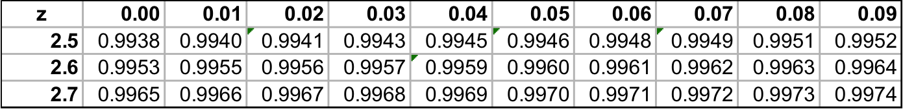
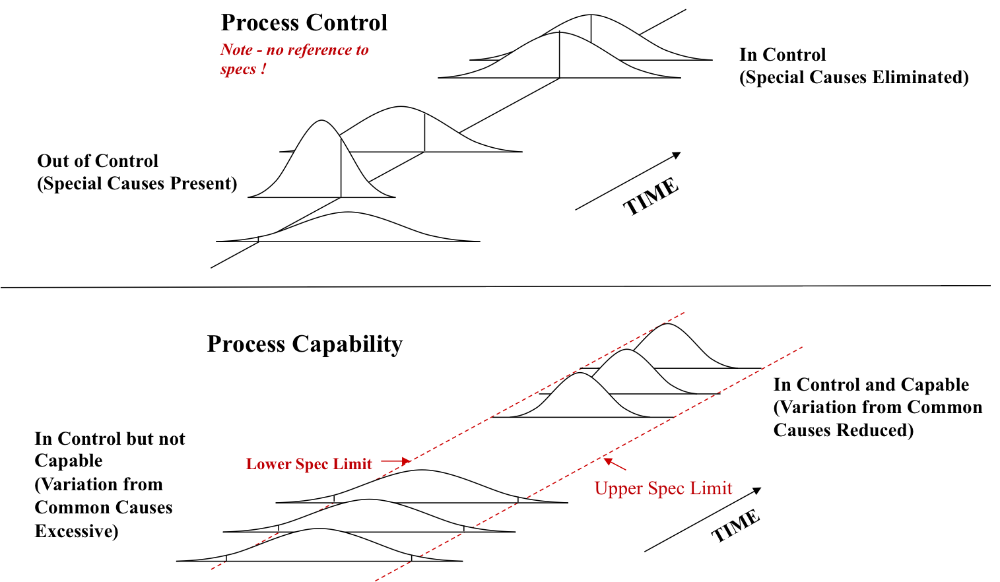
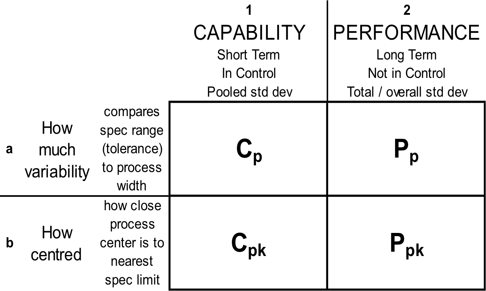
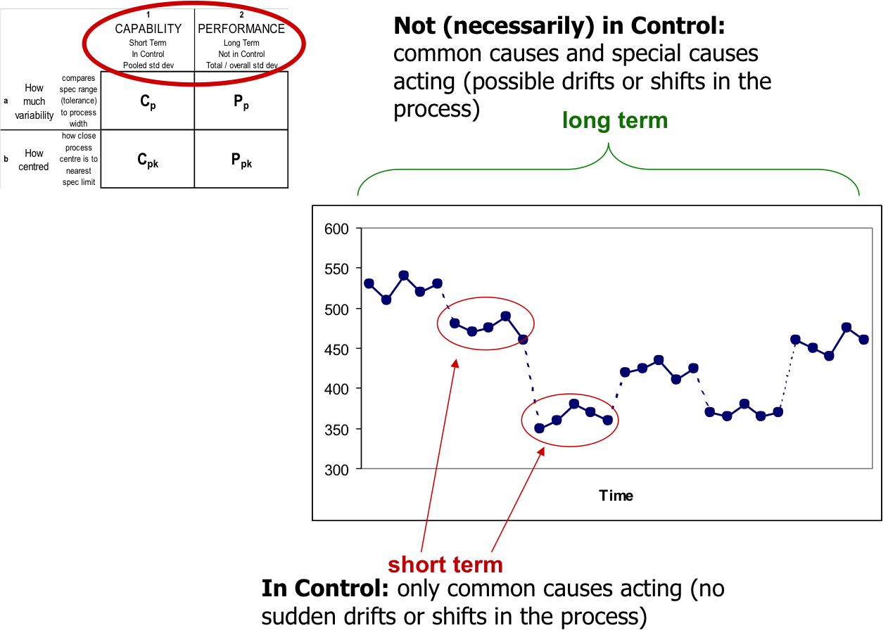
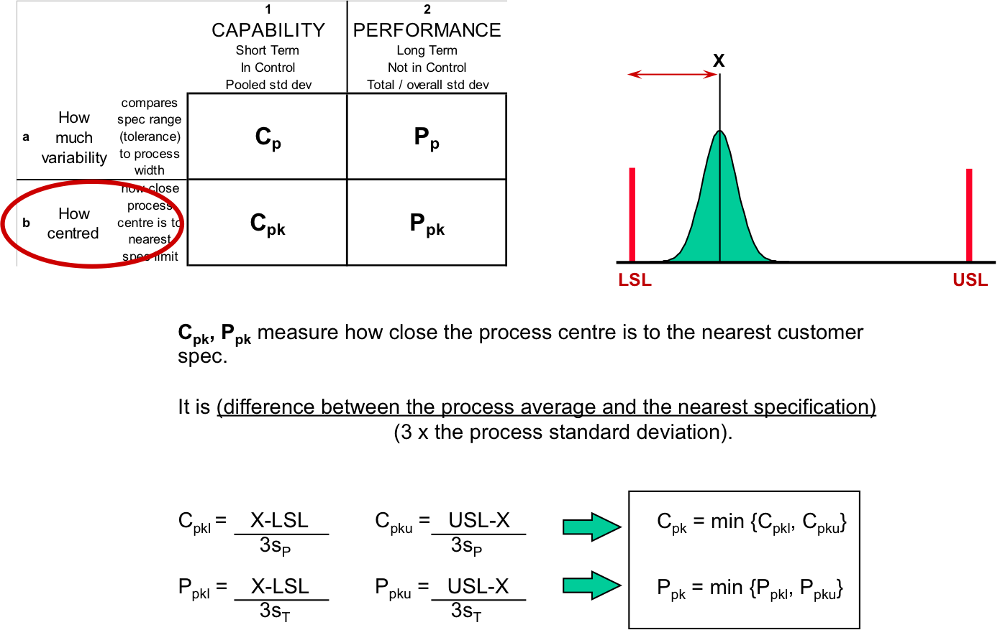

```{r, echo= FALSE, warning= FALSE, message=FALSE}
library(mosaic)
library(qicharts)
library(qcc)
library(knitr)
library(calibrate)
library(SixSigma)
options(digits = 4)

load("~/Dropbox/RData/SixSigma/output/BSRex2.RData")
load("~/Dropbox/RData/SixSigma/output/BSRex3.RData")
load("~/Dropbox/RData/SixSigma/output/BSRex4.RData")
```


## Session Objectives
* Upon completion of this session, you should be able to:
    + Calculate basic statistics
    + Create Pareto Charts
    + Calculate probabilities of a Poisson distribution
    + Calculate probabilities of a Normal distribution
    + Create Control Charts
    + Solve simple practical problems using Minitab combined with critical thinking

## Statistics
* Statistics is divided into two major areas
    + Descriptive Statistics 
    + Inferential Statistics

* Descriptive Statistics characterizes, summarizes, and graphically displays data
    + Examples - graphs, charts, tables, mean, standard deviation, and percentiles

* Inferential Statistics is the use of sample data to draw conclusions about the population from which the
  sample was drawn
      + opinion polling, evaluating research results, statistical process control, reducing variation to
      optimize design performance.  
 
* Probability is the link between descriptive statistics and inferential statistics that evaluates the
  uncertainty involved in using smaller samples to infer things about entire populations. 

## Statistics is a tool for converting data into information
* Provides information to select the right projects

* Quantifies current performance against improvements against customer requirements

* Provides insight into cause and effect

* Predicts product and process capability

* Shows process trends, changes, and anomalies

## Continuous and Discrete Probability Distributions

* The following statistics come from which type of distribution?

    - Average of 5 phone calls per hour
    - There is 12 minutes between calls on average
    - The rivets have an average length of 25mm
    - Average of 2 launch failures per 100

```{r}
histogram(rpois(1000, 5), main = "Discrete - Countable")
histogram(rnorm(10000), density = TRUE, main = "Continuous - Real Interval")
```

## Normal Distribution

* Frequently, a stable, controlled process will produce a histogram that resembles the bell shaped curve
  otherwise known as the normal distribution
  
    + The properties of the normal distribution make it a highly utilized distribution in understanding,
    improving, and controlling processes

* The normal distribution has applications such as:

    **Process capability**
    
    **Sigma measurements**
    
    **Measurement system analysis**
    
    **Design tolerancing**
    
    **Control Charts**
    
    **Process sampling plans Normal Probability** 

## The Empirical Rule

**Standard Normal Distribution: $\mu$ = 0 and $\sigma$ = 1**

    *99.7% of data are within 3 standard deviations of the mean*
    
    *95% within 2 standard deviations*
    
    *68% within 1 standard deviation*

```{r}
 xpnorm(c(-3, -2, -1, 0, 1, 2, 3), mean=0, sd=1)
```

## Standard Normal Distribution and Probaility

Consider a process with a mean of 50 and standard deviation of 2 minutes

What is the probability that the process will take less than 55 minutes?

`P(X <= 55) = P(Z <= 2.5) = 0.9938`

`P(X >  55) = P(Z >  2.5) = 0.0062`

How does the probability change if the standard deviation is 3? Why?

Now you try, change the `mean`, `standard deviation` and `probability value`. 

```{r, echo=FALSE}
inputPanel(
  sliderInput("mean", label = "Mean:",
              min = 30, max = 100, value = 50, step = 1),
  
  sliderInput("sd", label = "Standard Deviation:",
              min = 0, max = 10, value = 2, step = 1),
  
  sliderInput("prob", label = "Probability of:",
              min = 0, max = 150, value = 55, step = 1)
)

renderPlot({
  xpnorm(q = as.numeric(input$prob), mean = as.numeric(input$mean), sd = as.numeric(input$sd))
})
```

What if your manager asked you, "With 95% confidence, how long will the process take?"

`P(X <= 53.2897) = 0.95`

`P(X >  53.2897) = 0.05`

```{r, echo=FALSE}
inputPanel(
  sliderInput("mean2", label = "Mean:",
              min = 30, max = 100, value = 50, step = 1),
  
  sliderInput("sd2", label = "Standard Deviation:",
              min = 0, max = 10, value = 2, step = 1),
  
  sliderInput("percent2", label = "Percent Probability:",
              min = 0, max = 1, value = .950, step = .025)
)

renderPlot({
  xqnorm(p = as.numeric(input$percent2), mean = as.numeric(input$mean2), sd = as.numeric(input$sd2))
})
```

## Using Z Score

<center> **$Z = \frac{X - \mu}{\sigma}$** </center>

* Z is the Z-score
* X is the requirement we are evaluating
* $\mu$ is the process mean
* $\sigma$ is the standard deviation

Consider a process with mean 50 days and standard deviation 2 days.   What is the probability that the
process will take less than 55 days?

<center> $P(X < 50) = P(\frac{X - \mu}{\sigma} < \frac{55 - 50}{2}) = P(Z < 2.50) = 0.9938 = 99.38%$ </center>


**Z-score Table**   
    


## Exercise 1 - Before Improvement

**Use R/RStudio to:**

* Create a histogram, Find the mean, median, and standard deviation

```{r ex1_hist}
# Used to create the dataframe. Already saved, so loading from folder
# bsr.ex1 <- read.csv("BSR_Ex1.csv", stringsAsFactors = FALSE) 
# using the mosaic package
load("~/Dropbox/RData/SixSigma/output/BSRex1.RData")
histogram(bsr.ex1$Before.Improvement, breaks = 10, main = "Histogram Before Inprovement", xlab = "Before Improvement")
fav_stats(bsr.ex1$Before.Improvement)
```

* Create an Individual Moving Range (IMR) chart

```{r ex1_imr}
# using the qicharts package
qic(bsr.ex1$Before.Improvement, chart = "i", main = "Before Improvement (I Chart)" , ylab = "Individual",
xlab = "Observation")
qic(bsr.ex1$Before.Improvement, chart = "mr", main = "Before Improvement (MR Chart)" , ylab = "Moving Range",
xlab = "Observation")
```


* What do you see when you compare the histogram to the run chart?

## Exercise 1 - After Improvement

Confirm that the assignable cause corrections have the Statapult process under control

```{r ex1_imr2}
qic(bsr.ex1$After.Improvement, chart = "i", main = "After Improvement (I Chart)" , ylab = "Individual",
xlab = "Observation")
qic(bsr.ex1$After.Improvement, chart = "mr", main = "After Improvement (MR Chart)" , ylab = "Moving Range",
xlab = "Observation")
```


What is the likelihood that the “after” process output will meet the specifications of 101.4 + or – 3 inches?

```{r ex1_hist2}
histogram(bsr.ex1$After.Improvement, breaks = 10, main = "Histogram After Inprovement", xlab = "After Improvement")
fav_stats(bsr.ex1$After.Improvement)
xpnorm(c(98.4, 104.4), mean = 101.4, sd = 0.9)
```

## Exercise 2

**Problem**

> Your boss has assigned you a project in the shipping and receiving department and has asked you to focus
> on the delivery problems.

> Display the data graphically to help guide your project focus

Delivery Problems | Qty
----------------- | ----------------
Late              | 36
Wrong Person      | 18
Missing Parts     | 12
Damaged Container | 8
Wrong Adress      | 2
Not Deliveres     | 1

```{r pareto}
# Using qcc package
defect  <- bsr.ex2$Qty
names(defect)  <- bsr.ex2$Delivery.Problems
pareto.chart(defect, ylab = "Delivery Problems", main = "Pareto of Delivery Problems", col=rainbow(length(defect)))
```

## Poisson Distribution

The Poisson distribution is used to model the number of events occurring within a given time interval.
The formula for the Poisson probability density (mass) function is 

<center> **$P(X=x) = \frac{\lambda^{x}\epsilon^{-\lambda}}{x!}$** </center>

Histogram of Poisson Distribution with $\lambda$ of 5

$\lambda$ is the shape parameter which indicates the average number of events in the given time interval.


```{r pois}
  plotDist("pois", lambda =5, col="green", kind='histogram')
```

* $\lambda$ is the shape parameter which indicates the average number of events in the given time interval.
 
* This distribution only uses mean $\lambda$, it does not require standard deviation.

* Wide applicability in modeling the number of random events that occur in a fixed sample space such
  as a time interval, or dimension– The Poisson Process:
  
    + Customers that arrive at a post office during a day
    + Wrong phone calls received during a week
    + Students that go to the instructor’s office during office hours
    + Number of packets that arrive at a network switch 
    + Number of defects per unit produced
    + Number of errors per document

## Exercise 3

*Problem A*

> The manager of software development has set a goal of no more than 5 defects per delivery.
> Based on the 30 deliveries, would you say this is realistic?

```{r}
fav_stats(bsr.ex3$X._of_defects)
histogram( bsr.ex3$X._of_defects, breaks = 10, xlab = "Number of Defects", type = "density")
#Probablity of 5 defects given a lambda of 5.633
ppois(5, 5.633)
#Another way of looking at it
pdist(dist = "pois", 5, lambda = 5.633, vlwd = 4, vcol = "red")
```

*Problem B*

> What is the likelihood that the number of defects will be greater than 7?
	
> What action would you take to meet the boss’s goal consistently?

> Use `bsr.ex3` dataframe for this exercise

```{r}

#Probability number of defects greater than 7
1 - pdist(dist = "pois", 7, lambda = 5.633, vlwd = 4, vcol = "red")
```

> Your turn, adjust the number of defects or lambda to see the probabilities.

```{r, echo=FALSE}

inputPanel(
  radioButtons("tail", "Probability Side:", c("Greater Than" = "greater", 
                                                "Less Than" = "less"), selected = "less"),
  sliderInput("defects", label = "Number of Defects:",
              min = 0, max = 15, value = 5, step = 1),
  
  numericInput("lambda", label = "Lambda:", value = 5.633,
              min = 0, max = 15,  step = 0.001)
)

renderPlot({
   pdist(dist = "pois", q = as.numeric(input$defects), lambda = input$lambda, vlwd = 4, vcol = "red")

})

 renderText({
  ifelse(input$tail == "less", paste("The Probaility the number of defects is less than ", input$defects,
                                    "given a lambda of ", input$lambda,  " is ", 
         ppois(input$defects, input$lambda)), paste("The Probaility the number of defects is greater than ",
                                                    input$defects,  "given a lambda of ", input$lambda,
                                                    " is ", 1 - ppois(input$defects, input$lambda)))
   })
```

## Exercise 4

**Problem**

> You work for the general manager of a self service warehouse shoe outlet.  She is under pressure to 
> increase customer satisfaction.

> Some customers have complained about getting on their hands and knees to reach shoes while others 
> complain about having to climb the racks to reach shoes.

> You collect some data (on the right) and come up with a recommendation.  What is it?

> What other data might you collect and why?

> Use `bsr.ex4` dataframe for this exercise

```{r, message=FALSE, warning=FALSE}
kable(bsr.ex4)
```

The output from the R console displays the summary of the linear regresssion model.

The fitted plot diplays the observations and the residual values from the predicted line.

```{r, message=FALSE, warning=FALSE}
fit <- lm(bsr.ex4$Shoe.Size ~ bsr.ex4$Height)
summary(fit)
# Scatter plot and regression line 
x <- bsr.ex4$Height
y <- bsr.ex4$Shoe.Size
plot(x, y, xlim = c(min(x)-2, max(x) + 2), ylim = c(min(y) - 2, max(y) + 2), xlab = "Height", 
     ylab = "Shoe Size", main = "Fitted Line Plot", col = "blue")
abline(fit, lwd = 2, col = "red")
# Calculate residuals and predicted values
res <- signif(residuals(fit), 5)
pre <- predict(fit)
# plot distances between points and the regression line
segments(x, y, x, pre, col = "green")
# add labels (res values) to points
textxy(x, y, res, cx=0.7)
```

## Process Capability

Process Capability  looks at short term capability and long term performance of a process with regard to
customer specifications.

Standard indexes are used: Cp, Cpk, Pp and Ppk. 

**A simple view of Process Control and Process Capability**

Process control - refers only to the `“voice of the process”` - looking at the process using an agreed
performance measure to see whether the process forms a stable distribution over time.

Process capability - measures the `“goodness of a process”` - comparing the `voice of the process with the
“voice of the customer”`. The voice of the customer here is the specification range (tolerance) and/or the
nearest customer specification limit.

> The objective is to get as close to the theoretical best that your process can achieve by eliminating
special causes of variation, so that only common (natural) causes are acting on the process, and then 
to reduce these to a minimum, whenever possible.



## Capability and Performance



## Capability Indexes: explaning the terms





## Exercise 5

*Problem A*

> Do a capability analysis (Upper spec limit =104.4; lower spec limit = 98.4) for both baseline and after
improvement columns.

> Based on this analysis was there improvement before and after?

> Use bsr.exe1 for this exercise

```{r, fig.height=8, fig.width=8}
# Process Capbility Before Improvement
ss.study.ca(bsr.ex1$Before.Improvement, LSL = 98.4, USL = 104.4, T = mean(bsr.ex1$Before.Improvement), alpha = 0.05, 
            f.main = "Process Capability Before Improvement")
# Process Capability After Improvement
ss.study.ca(bsr.ex1$After.Improvement, LSL = 98.4, USL = 104.4, T = mean(bsr.ex1$After.Improvement), alpha = 0.05,
            f.main = "Process Capability After Improvement")

```

## Session Summary

You should be able to use R/RStudio to:

Calculate basic statistics

Create Pareto Charts

Calculate probabilities of a Poisson distribution

Calculate probabilities of a Normal distribution

Create Control Charts

Solve simple practical problems using R/Rstudio combined with critical thinking
